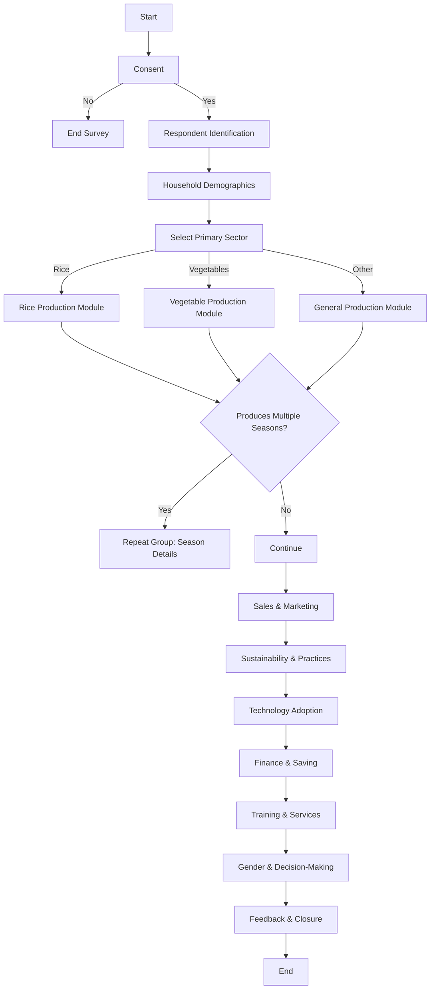
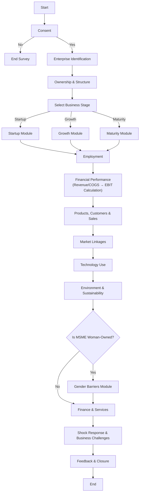

---

# Survey flow charts for producer and MSME survey forms

---

Below are two clear survey‑flow charts—one for the Producer Survey and one for the MSME Survey—based on the XLSForm logic patterns you shared earlier.

> These are fully NDA‑safe, client‑neutral, and structured so you can paste them directly into GitHub Markdown.

---

## 1. Producer Survey – Survey Flow Chart

--- 

## 2. MSME Survey – Survey Flow Chart 

